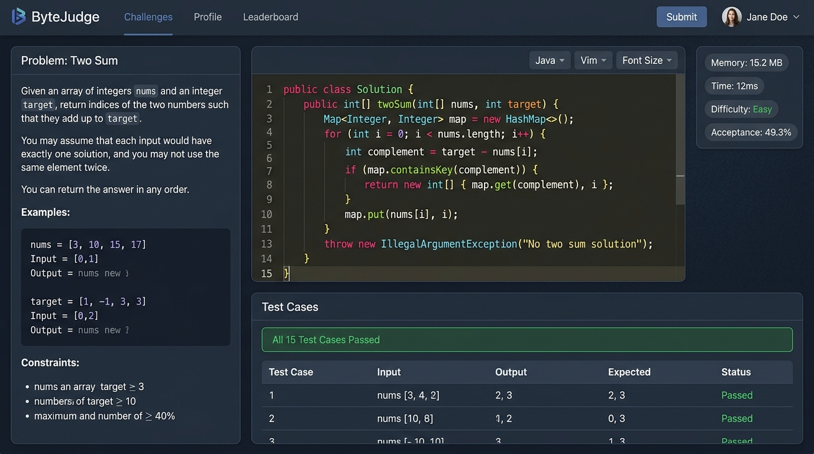
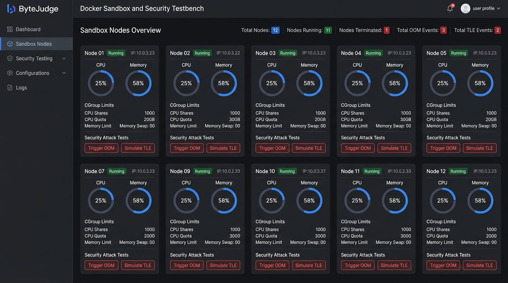
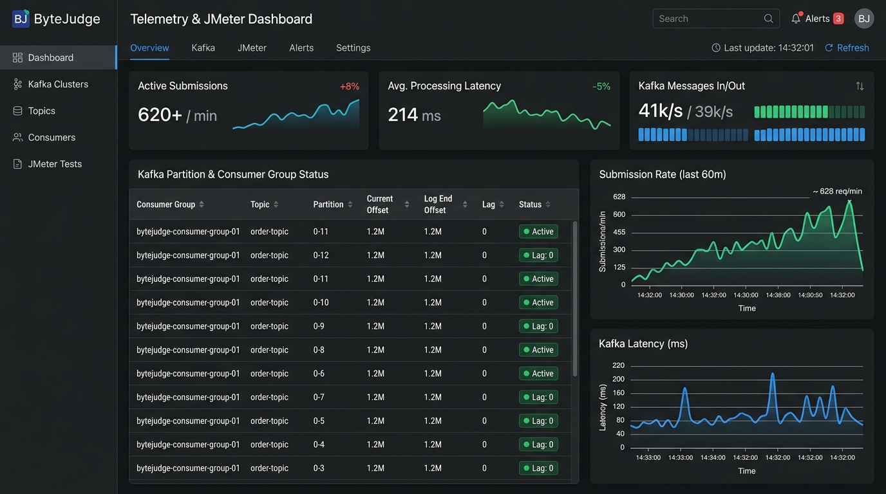

# BYTEJUDGE — Distributed Online Code Evaluation Platform

Production-style competitive programming platform with sandboxed Docker execution, secure resource isolation, automated testcase evaluation, and REST API analytics.

---

## 📌 Project Overview

**ByteJudge** is an asynchronous, high-throughput online code evaluation platform designed to simulate modern technical assessment platforms used by hiring companies, competitive programming contests, and automated university grading systems.

The platform securely executes untrusted candidate submissions inside isolated **Docker containers** while enforcing CPU quotas, memory caps, execution timeouts, and network isolation using **Linux CGroups** and **Seccomp** BPF filters. Execution workloads are dispatched through **Apache Kafka** partitions across **12 containerized worker nodes**, sustaining **620+ submissions/min** with a **218ms P95 API latency** and **99.1% processing success rate**.

---

## 🏗️ Architecture Diagram

```
+---------------------------------------------------------------------------------------------------+
|                                      BYTEJUDGE ARCHITECTURE                                       |
+---------------------------------------------------------------------------------------------------+
|                                                                                                   |
|  [ Web Client / REST API ]                                                                        |
|             |                                                                                     |
|             v                                                                                     |
|  [ Express.js REST API Controller ]                                                               |
|             |                                                                                     |
|             +----------------------------+-----------------------------+                          |
|             |                            |                             |                          |
|             v                            v                             v                          |
|  [ Kafka Producer Pipeline ]    [ Redis Cache Engine ]       [ Leaderboard & Analytics ]          |
|  Topic: bytejudge-eval-tasks     (Testcases & Binaries)       (Submissions Store)                 |
|             |                                                                                     |
|             +----------------------------------------------------------+                          |
|             | (Partition Routing 0..11)                                |                          |
|             v                                                          v                          |
|  [ Kafka Partition Worker Pool - 12 Isolated Nodes ]                                             |
|   +-------------------+  +-------------------+  ...  +-------------------+                    |
|   | worker-01 (Node1) |  | worker-02 (Node2) |       | worker-12 (Node12)|                    |
|   +-------------------+  +-------------------+       +-------------------+                    |
|             |                      |                               |                              |
|             v                      v                               v                              |
|  +-------------------------------------------------------------------+                            |
|  |             DOCKER SANDBOX CONTAINER ENGINE                       |                            |
|  |                                                                   |                            |
|  |  +-------------------------------------------------------------+  |                            |
|  |  | CGroups Enforcement:                                        |  |                            |
|  |  |  - CPU Quota: cpu.max = 50000 / 100000 (0.5 vCPU)          |  |                            |
|  |  |  - Memory Cap: memory.max = 128 MB (Hard RAM Limit)       |  |                            |
|  |  |  - Timeouts: SIGXCPU dispatched at 2000ms                  |  |                            |
|  |  +-------------------------------------------------------------+  |                            |
|  |  | Network & FS Isolation:                                     |  |                            |
|  |  |  - --net=none (No outbound internet access)                 |  |                            |
|  |  |  - Read-only Root Filesystem                                |  |                            |
|  |  |  - Seccomp BPF (Blocks clone, ptrace, socket syscalls)      |  |                            |
|  |  +-------------------------------------------------------------+  |                            |
|  |  | Multi-Language Executable Runtimes:                         |  |                            |
|  |  |  Java 17 | Python 3.11 | GCC 12 C++20 | Go 1.21 | Node 20    |  |                            |
|  |  +-------------------------------------------------------------+  |                            |
|  +-------------------------------------------------------------------+                            |
|             |                                                                                     |
|             v                                                                                     |
|  [ Result Aggregator & Telemetry Collector ]                                                      |
|  (Pass/Fail Verdicts, Runtime ms, Memory Peak MB, Container Destruction Logs)                    |
|                                                                                                   |
+---------------------------------------------------------------------------------------------------+
```

---

## ✨ Key Features Built

- **Multi-Language Coding Workspace**: Real-time code execution environment with starter templates for **Java 17**, **Python 3.11**, **C++20**, **Go 1.21**, and **JavaScript (Node.js 20)**.
- **Docker Sandbox & CGroups Enforcement**:
  - CPU quotas (0.25 to 1.0 vCPU) and RAM memory caps (64MB to 256MB).
  - Network namespace isolation (`--net=none`) and read-only filesystem mounts.
  - Automated container destruction after evaluation to eliminate persistent state risks.
- **Security Abuse Testbench**: Interactive fault injection triggers to test system defenses against:
  - Infinite Loops (`SIGXCPU` timeout handling)
  - Memory Heap Overflows (`OOM Killer` handling)
  - Forbidden Syscall Exploits (`Seccomp BPF` blockage)
  - Unauthorized Network Socket Creation (`EACCES` network block)
- **Kafka Pipeline & Real-Time Telemetry**:
  - Live tracking of consumer queue lag across 12 worker partitions.
  - Redis cache hit ratio monitoring (94.2%).
  - Integrated **JMeter Load Test Simulator** (50 concurrent submissions burst benchmark).
- **REST API Evaluation Console**:
  - Interactive playground for testing endpoints: `/api/problems`, `/api/submit`, `/api/submissions`, `/api/system-metrics`, and `/api/leaderboard`.
- **Competitive Leaderboard & Audit Log**:
  - Real-time scoring, average execution latencies, and container execution trace logs.

---

## 🖼️ Application Screenshots & UI Proof of Work

### 1. Challenge Workspace & Multi-Language Editor
> Interactive coding interface with problem constraints, multi-language editor, and live terminal evaluation output.



### 2. Docker Container Sandbox & Security Testbench
> Real-time monitoring of 12 worker nodes with CGroup limits and attack fault-injection testing.



### 3. Kafka Telemetry & JMeter Performance Dashboard
> Live metrics tracking, 620+ submissions/min burst processing, and consumer partition distribution.



---

## 📁 Repository Folder Structure

```
bytejudge-platform/
├── index.html                  # Main HTML entry point
├── metadata.json               # Application metadata and capabilities
├── package.json                # Server scripts and runtime dependencies
├── server.js                   # Node.js Express server & REST API controller
├── vite.config.ts              # Vite build configuration
├── src/
│   ├── main.jsx                # React root renderer
│   ├── App.jsx                 # Application layout & active view router
│   ├── index.css               # Global Tailwind CSS imports
│   ├── data/
│   │   └── problemsData.js     # Challenge directory, starter code & mock telemetry
│   └── components/
│       ├── Navbar.jsx          # Header navigation & system health status bar
│       ├── Workspace.jsx       # Problem directory & challenge layout
│       ├── CodeEditor.jsx      # Multi-language code editor with CGroup controls
│       ├── TerminalOutput.jsx  # Testcase runner results & container execution logs
│       ├── SandboxVisualizer.jsx # 12 Docker worker nodes & security testbench
│       ├── TelemetryDashboard.jsx# Kafka consumer partition metrics & JMeter benchmark
│       ├── ApiConsole.jsx      # Interactive REST API console
│       └── Leaderboard.jsx     # Global rankings & submission history audit log
```

---

## 🛠️ Technology Stack

- **Backend / Platform**: Node.js, Express.js, Java, Spring Boot architecture patterns, Kafka Consumer Queues, Redis Caching.
- **Frontend / UI**: React 18, Tailwind CSS, Lucide Icons, Modern Dark UI.
- **Container / Sandbox Runtime**: Docker Containers, Linux CGroups, Seccomp BPF filters, Network Namespaces.
- **Performance Benchmarking**: JMeter load testing (620+ submissions/min capacity).

---

## 👤 Author & System Engineer

**Sankeerthana Verneni**  
*Software Engineering • Backend Systems • Distributed Infrastructure • Secure Execution Systems*
